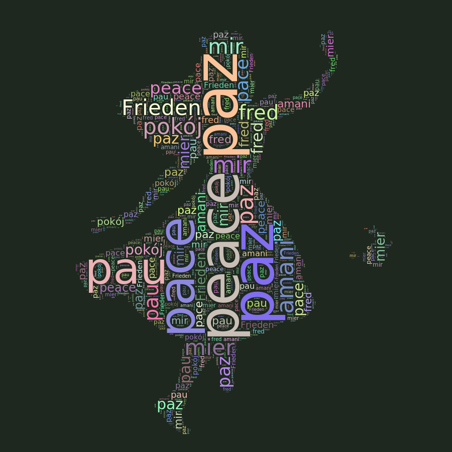
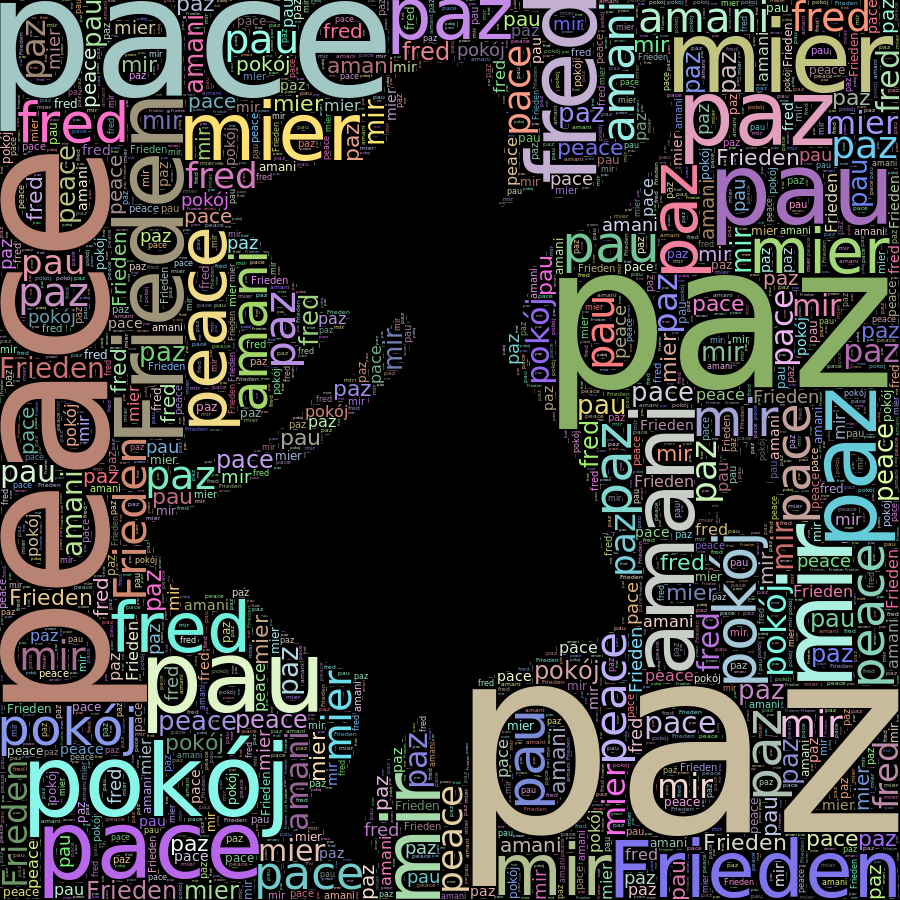

# mask_word_cloud
Word cloud cairo-based command line generator (png, pdf and svg) using a shape mask.

A little word cloud generator in C++ using [cairomm](http://cairographics.org/cairomm/). For the moment the part related with word processing is **very** rudimentary (you should better produce the expected word file with another program).

## Installation and Compiling

I have only tried on linux debian/ubuntu, you need first install:

    sudo apt-get install libcairomm-1.0-dev

and try just

    make
	
that will hopefully generate the `maskwd` executable:

    $ make
    g++ -std=c++11 -O3 -c mask_word_cloud.cc `pkg-config --cflags --libs cairomm-1.0`
    g++ -std=c++11 -O3 -o maskwc maskwc.cc mask_word_cloud.o `pkg-config --cflags --libs cairomm-1.0`

## Usage

There are several optional parameters:

```
$ ./maskwc -h
Usage: ./maskwc \
	[-h] \ (show this help)
	[-r red_background] \   (RGB of background, default 0 0 0 black
	[-g green_background] \  color components in scale 0-255
	[-b blue_background] \
	[-m mask_file] \ (determines also the size of image)
	[-R red_mask] \   (words can be painted where mask
	[-G green_mask] \  has this RGB color, default 0 0 0 black)
	[-B blue_mask] \
	[-c color_file] \ (must have the same size of mask, words colors are picked from here)
	[-f font_name] \  (e.g. Sans)
	[-s font_step] \  (default value 2, 1 is somewhat slower but more accurate)
	[-M min_font_size] \ (default value 4)
	[-o output_prefix] \ (default "output" generate "output.svg" "output.png" and "output.pdf") 
	[-d words_margin] \ (default value is 2)
	[-v vertical_preference] \ (value between 0 and 100, default is 50)
	words.txt (an ordered list of pairs word initial_size)
```

Try these parameter with the examples to better see how they work.

## Examples

The following mask:


has been taken from [this other word cloud repository](https://github.com/amueller/word_cloud).

The file `peace.txt` contains a sorted list of utf-8 encoded words accompanied with an initial size, this is very rudimentary and could be greatly improved:

```
$ cat peace.txt
peace 300
paz 300
pace 250
pau 100
paz 200
Frieden 100
...
```

The following output:



Is generated with the following command:

    ../maskwc -m alice_mask.png -r 30 -g 40 -b 30 -o alice_peace peace.txt

Although it is better to check the [svg](EXAMPLES/alice_peace.svg) and [pdf](EXAMPLES/alice_peace.pdf) files.

You can also specify the color used as mask in order to generate, for instance, a word cloud for the background:

    ../maskwc -m alice_mask.png -R 255 -G 255 -B 255 -o background_alice peace.txt



and the corresponding [EXAMPLES/background_alice.svg](svg) and [EXAMPLES/background_alice.pdf](pdf) files.

